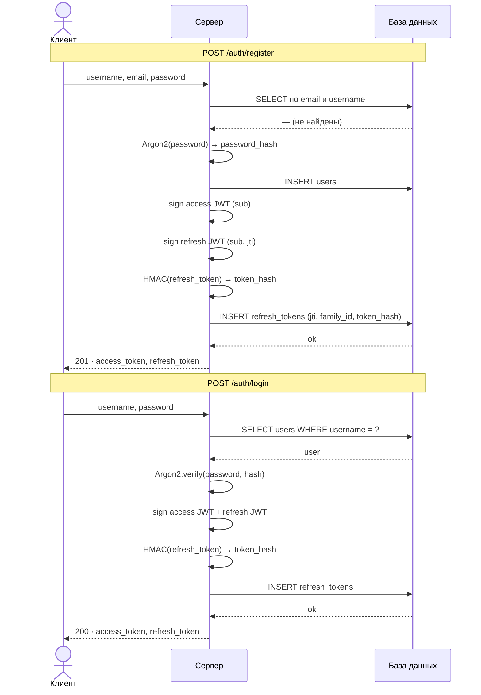
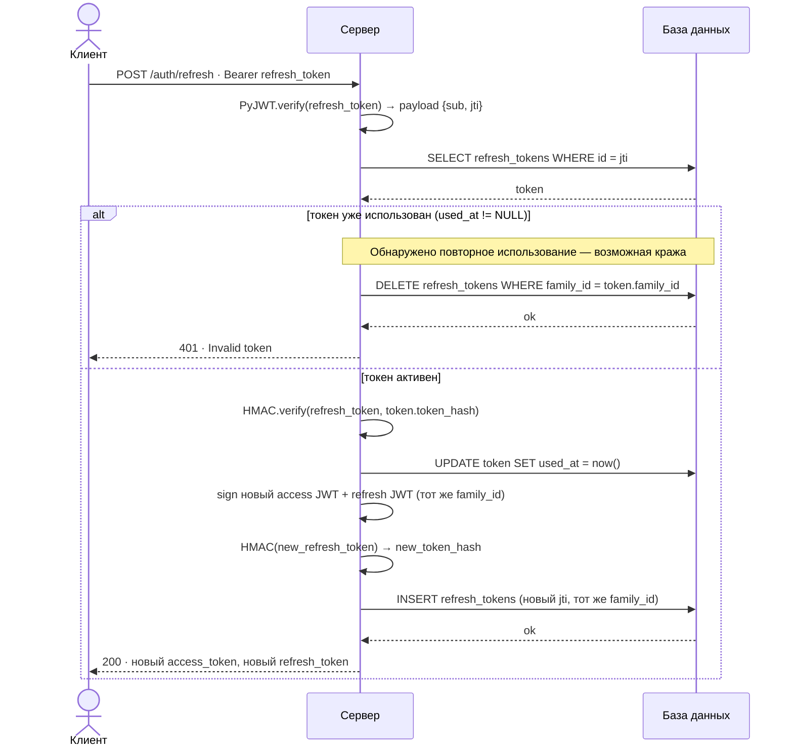
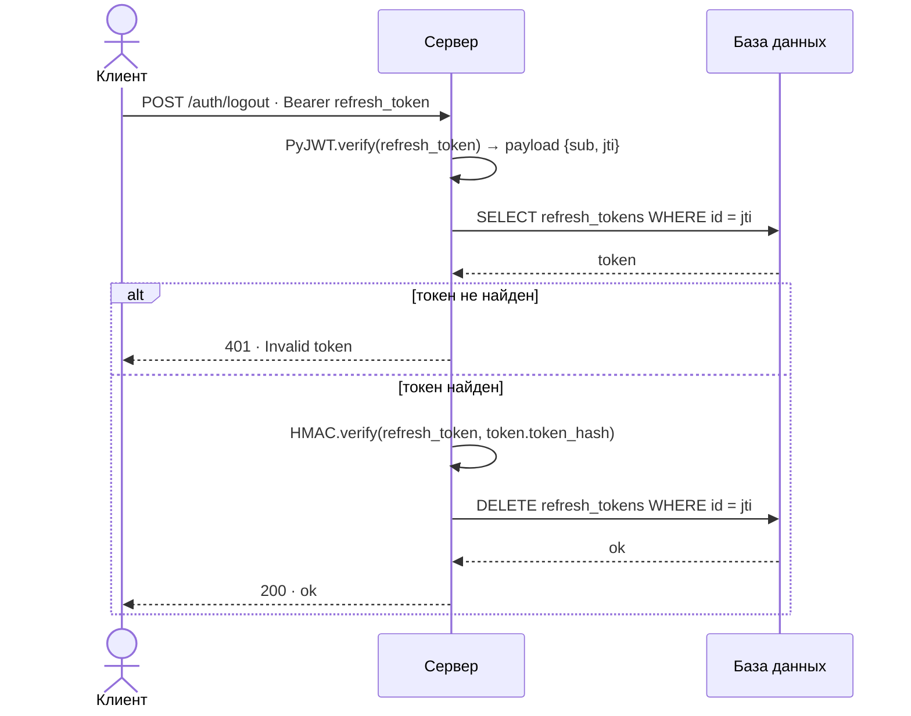

# FastAPI Authentication Demo

> **Внимание:** этот проект является учебной демонстрацией механизмов аутентификации на FastAPI.
> Он не предназначен для использования в продакшене в нынешнем виде.

---

## Содержание

- [О проекте](#о-проекте)
- [Что не реализовано](#что-не-реализовано)
- [Стек и структура](#стек-и-структура)
- [Запуск](#запуск)
- [Переменные окружения](#переменные-окружения)
- [Модули](#модули)
- [База данных](#база-данных)
- [Принципы аутентификации и защиты](#принципы-аутентификации-и-защиты)
- [Схемы потоков](#схемы-потоков)
- [API](#api)

---

## О проекте

Демонстрация полноценной stateful JWT-аутентификации на FastAPI с:

- регистрацией и входом по паролю;
- парой токенов: короткоживущий access-токен и долгоживущий refresh-токен;
- **Refresh Token Rotation** — при каждом обновлении старый токен аннулируется и выпускается новый;
- обнаружением кражи токена через **token family invalidation**;
- хранением только HMAC-хеша refresh-токена в базе данных (не сам токен);
- хешированием паролей алгоритмом **Argon2**.

---

## Что не реализовано

Список того, что намеренно опущено и потребовало бы доработки перед использованием в реальном проекте:

| Что                        | Почему важно                                                                                                                  |
| -------------------------- | ----------------------------------------------------------------------------------------------------------------------------- |
| Очистка истёкших токенов   | Таблица `refresh_tokens` растёт бесконечно. Нужна фоновая задача (cron / APScheduler), удаляющая записи с `expires_at < now`. |
| Rate limiting на `/login`  | Без ограничений возможна атака перебором паролей.                                                                             |
| Валидация сложности пароля | Сейчас принимается любая строка, включая пустую.                                                                              |
| Принудительный HTTPS       | JWT в заголовке передаётся открытым текстом по HTTP.                                                                          |
| Тесты                      | Нет ни unit-, ни integration-тестов.                                                                                          |
| Logout из всех устройств   | Нет эндпоинта, инвалидирующего все токены пользователя сразу.                                                                 |
| Смена пароля / email       | При смене пароля следует инвалидировать все активные refresh-токены.                                                          |
| SQLite в продакшене        | SQLite не подходит для конкурентной нагрузки. Для продакшена — PostgreSQL или MySQL.                                          |

---

## Стек и структура

| Компонент           | Технология                       |
| ------------------- | -------------------------------- |
| Язык                | Python 3.12                      |
| Менеджер пакетов    | [uv](https://docs.astral.sh/uv/) |
| Веб-фреймворк       | FastAPI                          |
| ORM / схемы БД      | SQLModel (SQLAlchemy + Pydantic) |
| База данных         | SQLite (через `DATABASE_URL`)    |
| JWT                 | PyJWT                            |
| Хеширование паролей | passlib + argon2-cffi            |
| Настройки           | pydantic-settings (`.env`)       |
| Миграции            | alembic                          |

```
.
├── main.py                         # Точка входа, создание FastAPI-приложения
├── lifespan.py                     # Инициализация БД при старте
├── settings.py                     # Конфигурация из .env
├── pyproject.toml
├── .env                            # Переменные окружения (не коммитить)
│
└── modules/
    ├── database/                   # Движок, сессии, транзакции
    └── auth/                       # Модуль аутентификации
        ├── router.py               # HTTP-эндпоинты /auth/*
        ├── controller.py           # Бизнес-логика
        ├── models/                 # Pydantic-схемы запросов и ответов
        └── modules/
            ├── jwt/                # Подписание и верификация JWT
            ├── password/           # Хеширование паролей (Argon2)
            ├── refresh_token/      # Сущность, репозиторий, HMAC-сервис
            └── user/               # Сущность и репозиторий пользователя
```

---

## Запуск

### Требования

- Python 3.12+
- [uv](https://docs.astral.sh/uv/) — установка: `pip install uv` или `curl -LsSf https://astral.sh/uv/install.sh | sh`

### Установка и запуск

```bash
# Установить зависимости
uv sync

# Создать файл с переменными окружения
cp .env.example .env   # или создать вручную (см. раздел ниже)

# Запустить сервер
uv run fastapi dev main.py
```

Swagger UI доступен по адресу: [http://localhost:8000/docs](http://localhost:8000/docs)

---

## Переменные окружения

Создайте файл `.env` в корне проекта:

```env
# Строка подключения к БД (SQLAlchemy DSN)
DATABASE_URL=sqlite:///database.db

# Access-токен
ACCESS_TOKEN_SECRET=<случайная строка>
ACCESS_TOKEN_EXPIRE_MINUTES=15

# Refresh-токен
REFRESH_TOKEN_SECRET=<случайная строка>
REFRESH_TOKEN_EXPIRE_MINUTES=10080   # 7 дней

# HMAC-секрет для хеширования refresh-токенов в БД
REFRESH_TOKEN_HMAC_SECRET=<случайная строка>

# Алгоритм подписи JWT
JWT_ALGORITHM=HS256
```

Для генерации секретов можно использовать:

```bash
python -c "import secrets; print(secrets.token_hex(32))"
```

---

## Модули

### `modules/database`

Отвечает за подключение к базе данных и управление сессиями.

- Создаёт глобальный движок SQLAlchemy на основе `DATABASE_URL`.
- Предоставляет FastAPI-зависимость `SessionDep` — открывает сессию на время обработки запроса и закрывает её после.
- Предоставляет контекстный менеджер `transaction()` — выполняет `commit` при успехе и `rollback` при любом исключении.
- Функция `setup_database()` вызывается при старте и создаёт все таблицы, если их ещё нет.

---

### `modules/auth`

Главный модуль аутентификации. Состоит из роутера, контроллера и четырёх подмодулей.

**Роутер** регистрирует эндпоинты `/auth/*` и передаёт управление контроллеру.

**Контроллер** (`AuthController`) — единственное место, где сосредоточена бизнес-логика: регистрация, вход, выход и ротация токенов. Все зависимости (репозитории, сервисы, сессия) внедряются через DI FastAPI.

---

### `modules/auth/modules/jwt`

Отвечает за подписание и верификацию JWT-токенов.

Состоит из двух уровней абстракции:

- **`JWTBaseService`** — низкоуровневый слой, который непосредственно вызывает `PyJWT`. Получает секрет, алгоритм и время жизни явными аргументами.
- **`JWTStrategy`** — инкапсулирует конфигурацию (`JWTConfig`) конкретного типа токена и делегирует вызовы `JWTBaseService`. Вызывающий код оперирует только `sign()` и `verify()`.

Модуль экспортирует два готовых экземпляра стратегии через зависимости: `JWTAccessDep` и `JWTRefreshDep`.

Для защиты эндпоинтов используется `make_jwt_bearer()` — фабрика, создающая FastAPI `Security`-зависимость, которая извлекает Bearer-токен из заголовка, верифицирует его и возвращает типизированные `JWTAuthorizationCredentials[TPayload]`.

---

### `modules/auth/modules/password`

Отвечает за хеширование паролей.

`HashService` оборачивает `passlib.CryptContext` и предоставляет два метода: `to_hashed()` для хеширования и `verify()` для проверки. Конкретный алгоритм (Argon2) задаётся при создании контекста в фабрике зависимости.

---

### `modules/auth/modules/refresh_token`

Отвечает за управление refresh-токенами.

- **`RefreshToken`** — SQLModel-сущность, хранящая метаданные токена в БД (без самого токена — только его HMAC-хеш).
- **`RefreshTokenRepository`** — инкапсулирует все запросы к таблице: создание, поиск по id, удаление, пометка как использованного, инвалидация всей семьи.
- **`HMACService`** — вычисляет и проверяет HMAC-SHA256 хеш строки токена. Использует `hmac.compare_digest` для защиты от timing-атак.

---

### `modules/auth/modules/user`

Отвечает за управление пользователями.

- **`User`** — SQLModel-сущность с полями `id`, `username`, `email`, `hashed_password`.
- **`UserRepository`** — инкапсулирует запросы к таблице: поиск по id, email или username, создание.

---

## База данных

### `users`

| Колонка           | Тип  | Описание                                  |
| ----------------- | ---- | ----------------------------------------- |
| `id`              | UUID | Первичный ключ                            |
| `username`        | TEXT | Уникальное имя пользователя               |
| `email`           | TEXT | Уникальный email (не возвращается в API)  |
| `hashed_password` | TEXT | Хеш пароля Argon2 (не возвращается в API) |

### `refresh_tokens`

| Колонка      | Тип      | Описание                                                       |
| ------------ | -------- | -------------------------------------------------------------- |
| `id`         | UUID     | Первичный ключ; совпадает с claim `jti` в JWT                  |
| `family_id`  | UUID     | Идентификатор семьи токенов одного сеанса                      |
| `user_id`    | UUID     | Внешний ключ на `users.id`                                     |
| `token_hash` | TEXT     | HMAC-SHA256 хеш строки токена                                  |
| `expires_at` | DATETIME | Время истечения                                                |
| `used_at`    | DATETIME | Время использования для `/refresh`; `NULL` — токен ещё активен |
| `created_at` | DATETIME | Время создания (UTC)                                           |

---

## Принципы аутентификации и защиты

### Два типа токенов

**Access-токен** — короткоживущий JWT (по умолчанию 15 минут). Используется для авторизации запросов к защищённым ресурсам. Нигде не хранится на сервере — только проверяется подпись.

**Refresh-токен** — долгоживущий JWT (по умолчанию 7 дней). Хранится в БД в виде HMAC-хеша. Используется исключительно для получения новой пары токенов через `/auth/refresh`.

### Refresh Token Rotation

При каждом обращении к `/auth/refresh` старый refresh-токен **помечается как использованный** (`used_at`), а не удаляется немедленно. Выпускается новая пара токенов в той же **семье** (`family_id`).

### Обнаружение кражи токена (Token Family Invalidation)

Если в `/auth/refresh` приходит токен, у которого `used_at` уже установлен — значит, кто-то пытается повторно использовать токен, который уже был задействован при ротации. Это признак возможной кражи. В этом случае **инвалидируется вся семья токенов** (`DELETE WHERE family_id = ...`), вынуждая владельца снова войти в систему.

### HMAC-защита refresh-токенов

В базе данных хранится не сам refresh-токен, а его **HMAC-SHA256 хеш** с отдельным секретом (`REFRESH_TOKEN_HMAC_SECRET`). Это означает, что при утечке базы данных злоумышленник не может воспользоваться записями из таблицы `refresh_tokens` — у него не будет исходных строк токенов.

### Хеширование паролей (Argon2)

Пароли хешируются алгоритмом **Argon2id** через библиотеку passlib. Argon2 — победитель Password Hashing Competition 2015, устойчивый к атакам с использованием GPU и специализированного железа.

---

## Схемы потоков

### Регистрация и вход



### Обновление токенов (Refresh Token Rotation)



### Выход из системы



---

## API

Все эндпоинты находятся под префиксом `/auth`.

| Метод  | Путь             | Описание                           | Успех | Ошибки |
| ------ | ---------------- | ---------------------------------- | ----- | ------ |
| `POST` | `/auth/register` | Регистрация нового пользователя    | `201` | `409`  |
| `POST` | `/auth/login`    | Вход по username и паролю          | `200` | `401`  |
| `POST` | `/auth/logout`   | Выход (инвалидация refresh-токена) | `200` | `401`  |
| `POST` | `/auth/refresh`  | Ротация пары токенов               | `200` | `401`  |

Эндпоинты `/logout` и `/refresh` принимают refresh-токен в заголовке:

```
Authorization: Bearer <refresh_token>
```

Интерактивная документация: `http://localhost:8000/docs`
